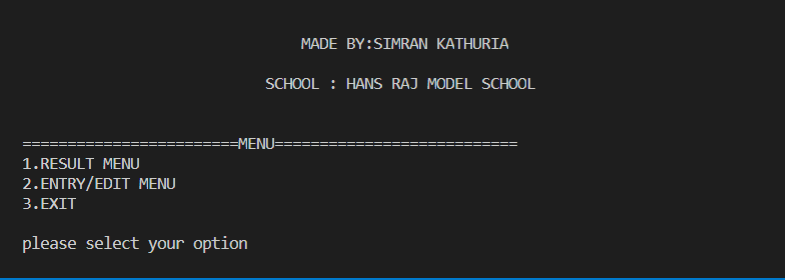
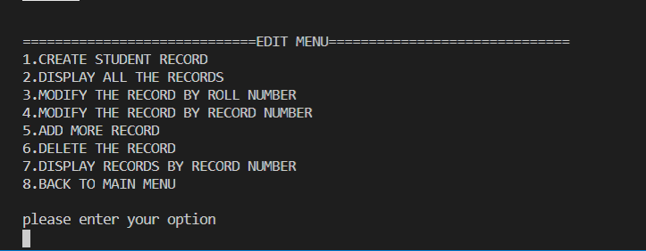
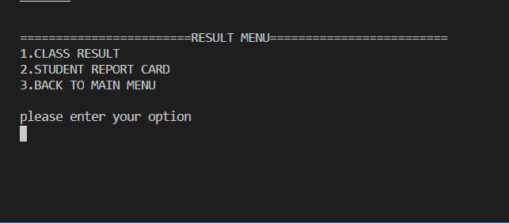

# REPORT CARD MANAGEMENT SYSTEM 

The school requires software to manage records for the report card generation. The software should be able to accept marks and calculate the percentage and the grade of the student and likewise generate a report for the same

### Screenshots

Main Menu Window  

Main Entry Window(Where user can add,alter or delete the records)

Result Window (Where user can see the class result or personal record card)

#### Following are the functions created in the program

void createfile();                     //CREATE THE RECORD FILE

void display();                           //READ ALL THE RECORDS

void displaybyroll();              //ACCEPT ROLL NUMBER AND READ RECORD

void displaybyrecno();          //ACCEPT RECORD NUMBER AND READ  RECORD

void modifybyroll();              //ACCEPT RECORD AND MODIFY RECORD

void modifybyrecno();          //ACCEPT RECORD NUMBER AND MODIFY  RECORD 

void appendfile();                    //ADD MORE RECORDS

void deletefile();                             //DELETE RECORD

void intro();                              //DISPLAY WELCOME SCREEN  

void entry_menu();                //DISPLAY ENTRY MENU ON SCREEN

void result();                            //DISPLAY RESULT MENU

void class_result();               //DISPLAY ALL RECORDS IN TABULAR FORMATE 
